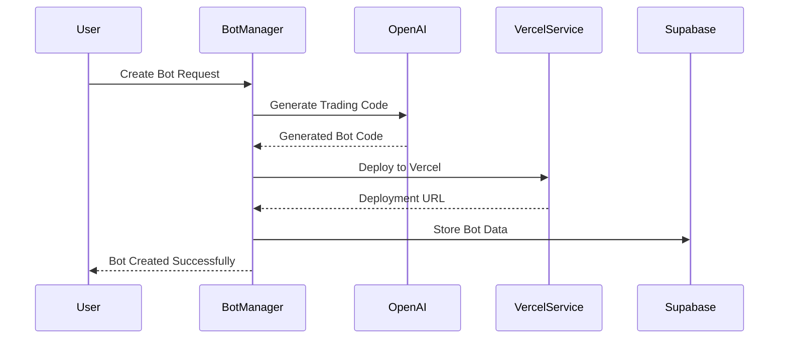
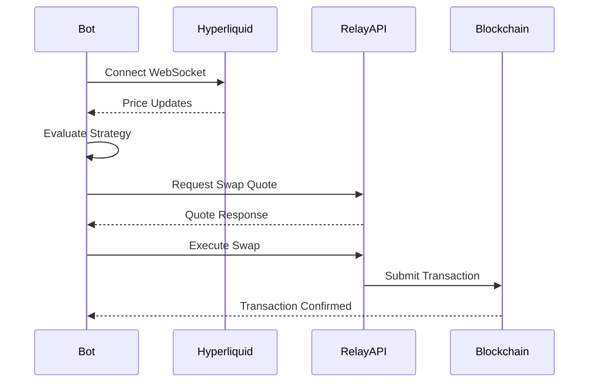

# Trading Bot API Backend

A sophisticated trading bot platform that generates AI-powered trading strategies, executes cross-chain swaps, and provides real-time market data analysis.

## 🏗️ Architecture Overview

The backend consists of several interconnected services that work together to create, deploy, and manage intelligent trading bots:

```
┌─────────────────┐    ┌─────────────────┐    ┌─────────────────┐
│   OpenAI API    │    │  Hyperliquid    │    │   Relay API     │
│   (Strategy)    │    │  (Price Data)   │    │ (Cross-chain)   │
└─────────────────┘    └─────────────────┘    └─────────────────┘
         │                       │                       │
         ▼                       ▼                       ▼
┌─────────────────────────────────────────────────────────────────┐
│                    Bot Manager (Core)                           │
├─────────────────────────────────────────────────────────────────┤
│  • Bot Creation & Management    • Strategy Execution            │
│  • WebSocket Management         • Cross-chain Swaps             │
│  • Performance Tracking         • Error Handling & Retry       │
└─────────────────────────────────────────────────────────────────┘
         │                       │                       │
         ▼                       ▼                       ▼
┌─────────────────┐    ┌─────────────────┐    ┌─────────────────┐
│   Vercel API    │    │   Supabase      │    │  Graph Token    │
│  (Deployment)   │    │   (Storage)     │    │     API         │
└─────────────────┘    └─────────────────┘    └─────────────────┘
```

## 🚀 Core Features

### 1. AI-Powered Bot Generation
- **Natural Language Processing**: Users describe trading strategies in plain English
- **Code Generation**: OpenAI generates complete, production-ready TypeScript code
- **Strategy Types**: Price thresholds, ranges, intervals, and custom logic
- **Multi-chain Support**: Works across 25+ blockchain networks

### 2. Real-time Market Data
- **Hyperliquid Integration**: Live price feeds via WebSocket connections
- **Multi-coin Monitoring**: Track multiple assets simultaneously
- **Historical Analysis**: Price history storage and trend analysis
- **Market Depth**: Real-time order book data

### 3. Cross-chain Swap Execution
- **Relay Protocol**: Seamless cross-chain token swaps
- **25+ Chains Supported**: Ethereum, Polygon, Base, Arbitrum, and more
- **Smart Routing**: Optimal paths for cross-chain transactions
- **Transaction Monitoring**: Real-time status tracking and confirmations

### 4. Automated Deployment
- **Vercel Integration**: Bots deployed as serverless functions
- **Environment Management**: Automatic configuration of API keys and settings
- **Scaling**: Auto-scaling based on trading activity
- **Monitoring**: Built-in logging and performance metrics

### 5. Portfolio & Balance Management
- **Wallet Tracking**: Real-time balance monitoring across chains
- **Portfolio Analytics**: Total value calculation and performance metrics
- **Token Metadata**: Comprehensive token information and validation
- **Transaction History**: Complete audit trail of all activities

## 🔄 Backend Flow

### 1. Bot Creation Flow


### 2. Trading Execution Flow


### 3. Data Flow Architecture
```
┌─────────────┐     ┌─────────────┐     ┌─────────────┐
│   Request   │────▶│ Validation  │────▶│ Processing  │
└─────────────┘     └─────────────┘     └─────────────┘
                                               │
┌─────────────┐     ┌─────────────┐     ┌─────────────┐
│  Response   │◀────│   Storage   │◀────│ Execution   │
└─────────────┘     └─────────────┘     └─────────────┘
```

## 📁 Project Structure

```
trading-bot-api/
├── src/
│   ├── routes/
│   │   └── bots.ts              # API endpoints for bot management
│   ├── services/
│   │   ├── bot-manager.ts       # Core bot management logic
│   │   ├── openai.ts           # AI strategy generation
│   │   ├── hyperliquid.ts      # Real-time price data
│   │   ├── relay.ts            # Cross-chain swap execution
│   │   ├── vercel-deploy.ts    # Serverless deployment
│   │   ├── supabase.ts         # Database operations
│   │   ├── graph.ts            # Portfolio & balance tracking
│   │   └── storage.ts          # Local data management
│   ├── types/
│   │   └── index.ts            # TypeScript type definitions
│   └── utils/                  # Utility functions
├── data/
│   └── bots-template.json      # Bot configuration templates
├── package.json                # Dependencies and scripts
├── tsconfig.json              # TypeScript configuration
├── vercel.json                # Deployment configuration
└── README.md                  # This file
```

## 🛠️ Service Breakdown

### BotManager (Core Service)
- **Bot Lifecycle**: Creation, activation, deactivation, deletion
- **Strategy Execution**: Real-time monitoring and trade execution
- **Performance Tracking**: Success rates, execution logs, analytics
- **Error Handling**: Retry logic, failure recovery, alerting

### OpenAI Service
- **Code Generation**: Creates complete trading bot implementations
- **Strategy Optimization**: Analyzes performance and suggests improvements
- **Natural Language Processing**: Converts user prompts to executable code
- **Template Management**: Maintains reusable code patterns

### Hyperliquid Service
- **WebSocket Management**: Maintains persistent connections for real-time data
- **Price Monitoring**: Tracks multiple assets simultaneously
- **Data Normalization**: Converts raw market data to standardized format
- **Connection Recovery**: Automatic reconnection and error handling

### Relay Service
- **Cross-chain Routing**: Finds optimal paths for token swaps
- **Quote Management**: Real-time pricing for cross-chain transactions
- **Transaction Execution**: Handles complex multi-step swaps
- **Status Tracking**: Monitors transaction progress across chains

### Vercel Deploy Service
- **Serverless Deployment**: Deploys bots as Vercel functions
- **Environment Configuration**: Manages API keys and settings
- **Code Optimization**: Bundles and optimizes bot code for deployment
- **Scaling Management**: Handles auto-scaling based on usage

### Graph Service
- **Portfolio Tracking**: Real-time balance monitoring across chains
- **Token Analytics**: Comprehensive token metadata and metrics
- **Transaction History**: Complete audit trail of wallet activities
- **Multi-chain Support**: Works across all major EVM networks

## 🔧 Configuration

### Environment Variables
```bash
# Core API Keys
OPENAI_API_KEY=your_openai_api_key
VERCEL_TOKEN=your_vercel_token
RELAY_API_KEY=your_relay_api_key
GRAPH_API_KEY=your_graph_jwt_token

# Database
SUPABASE_URL=your_supabase_url
SUPABASE_ANON_KEY=your_supabase_key

# Trading Configuration
DEFAULT_TARGET_COIN=SOL
IS_TESTNET=false
```

### Bot Configuration
```typescript
interface BotCreationRequest {
  name: string;                    // Human-readable bot name
  prompt: string;                  // Natural language strategy description
  targetCoin?: string;            // Asset to monitor (default: SOL)
  swapConfig: SwapRequest;        // Cross-chain swap parameters
  strategy?: Partial<TradingStrategy>; // Optional strategy overrides
  userWallet?: string;            // User's wallet address
}
```

## 🔄 API Endpoints

### Bot Management
- `POST /api/bots` - Create new trading bot
- `GET /api/bots` - List all bots
- `GET /api/bots/:id` - Get specific bot details
- `PUT /api/bots/:id/activate` - Activate bot
- `PUT /api/bots/:id/deactivate` - Deactivate bot
- `DELETE /api/bots/:id` - Delete bot

### Trading Operations
- `POST /api/bots/:id/execute` - Manual trade execution
- `GET /api/bots/:id/logs` - Execution history
- `GET /api/bots/:id/performance` - Performance analytics
- `POST /api/bots/:id/optimize` - Strategy optimization

### Portfolio Management
- `GET /api/portfolio/:address` - Portfolio overview
- `GET /api/balances/:address` - Token balances
- `GET /api/history/:address` - Transaction history

## 🚦 Getting Started

### 1. Installation
```bash
npm install
```

### 2. Environment Setup
```bash
cp env.example .env
# Edit .env with your API keys
```

### 3. Database Setup
```bash
npm run db:setup
```

### 4. Development
```bash
npm run dev
```

### 5. Production Build
```bash
npm run build
npm start
```

## 📊 Monitoring & Analytics

### Performance Metrics
- **Execution Success Rate**: Percentage of successful trades
- **Average Response Time**: API and WebSocket latency
- **Portfolio Performance**: ROI and PnL tracking
- **Error Rates**: Failed transactions and recovery times

### Logging
- **Structured Logging**: JSON-formatted logs with timestamps
- **Log Levels**: Debug, Info, Warning, Error, Critical
- **Correlation IDs**: Track requests across services
- **Performance Profiling**: Identify bottlenecks and optimize

### Health Checks
- **Service Status**: Monitor all external dependencies
- **Connection Health**: WebSocket and API connectivity
- **Resource Usage**: Memory, CPU, and network metrics
- **Alert System**: Automated notifications for issues

## 🔒 Security Features

### Authentication & Authorization
- **JWT Tokens**: Secure API access with expiring tokens
- **Rate Limiting**: Prevent abuse with request throttling
- **Input Validation**: Sanitize and validate all inputs
- **CORS Protection**: Secure cross-origin requests

### Data Protection
- **Encryption**: All sensitive data encrypted at rest and in transit
- **Key Management**: Secure storage and rotation of API keys
- **Audit Logging**: Complete audit trail of all operations
- **Privacy Controls**: User data protection and GDPR compliance

### Trading Security
- **Balance Validation**: Verify sufficient funds before trading
- **Slippage Protection**: Prevent excessive price impact
- **Transaction Limits**: Configurable maximum trade sizes
- **Emergency Stops**: Circuit breakers for unusual market conditions

## 🚀 Deployment

### Vercel (Recommended)
```bash
vercel deploy
```

### Docker
```bash
docker build -t trading-bot-api .
docker run -p 3000:3000 trading-bot-api
```

### Traditional Server
```bash
npm run build
npm run start:prod
```

## 🤝 Contributing

1. Fork the repository
2. Create a feature branch
3. Make your changes
4. Add tests for new functionality
5. Submit a pull request

## 📝 License

This project is licensed under the MIT License - see the LICENSE file for details.

## 🆘 Support

For support and questions:
- Create an issue on GitHub
- Check the documentation
- Review the troubleshooting guide

---

Built with ❤️ for the DeFi community